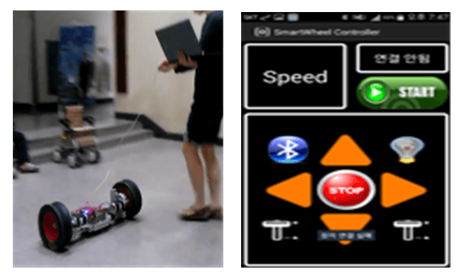

# 스마트 탈부착 바퀴 프로젝트
* 기간 : 2015.04.06.~2015.12.10
* 주최 : 2015 한이음 ICT 빅 프로젝트
* 참여자 : 유용희(멘토), 윤태영, 박정은, 광운대 로봇공학과 4명

##사진

## 개발 내역

1. 주제 : 스마트 탈부착 바퀴
2. 특징 : 유모차, 휠체어 등 수동바퀴 제품에 부착하여 전동 제품의 효과
3. 개발 툴 : eclipse, 아두이노
4. 개발 기술 : Java, Android, 블루투스 소켓 통신

## 진행 및 소득

* 광운대 로봇공학과 학생들과 팀을 이뤄 하드웨어와 소프트웨어를 개발
* 스마트 탈부착 바퀴는 수동 제품에 자동 바퀴를 부착하여 전동 제품을 값싸게 대체할 수 있다는 아이디어를 바탕
* 바퀴 제어를 위한 안드로이드 앱을 개발
* 안드로이드 소켓 통신에 대한 이해, 그리고 다른 과와의 협업 경험
